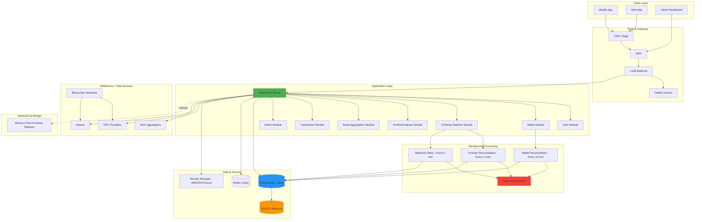
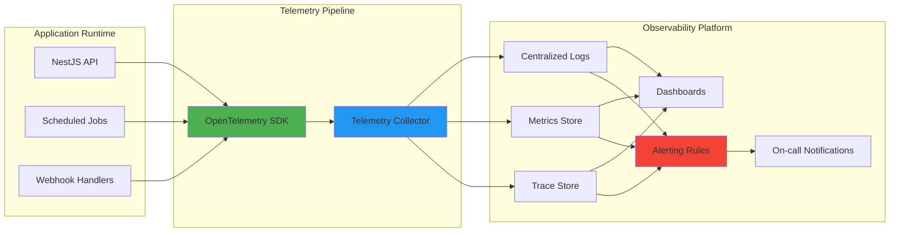

# Architecture

Enterprise architecture for the crypto wallet platform.

## Operating Model

- **IronVault = Interface + Intelligence**
- **Blockchain = Settlement layer**
- **On-ramps = Optional bridges**
- **Binance is used only as a fiat on-ramp redirect, not as a custody or balance source**

## Dashboard Data Sources (Non-Custodial)

- On-chain balances via RPC
- Token portfolio via indexer
- Swap history via on-chain transaction hashes
- No exchange account balance as source of truth

## System Architecture

## Monitoring & Observability Architecture

