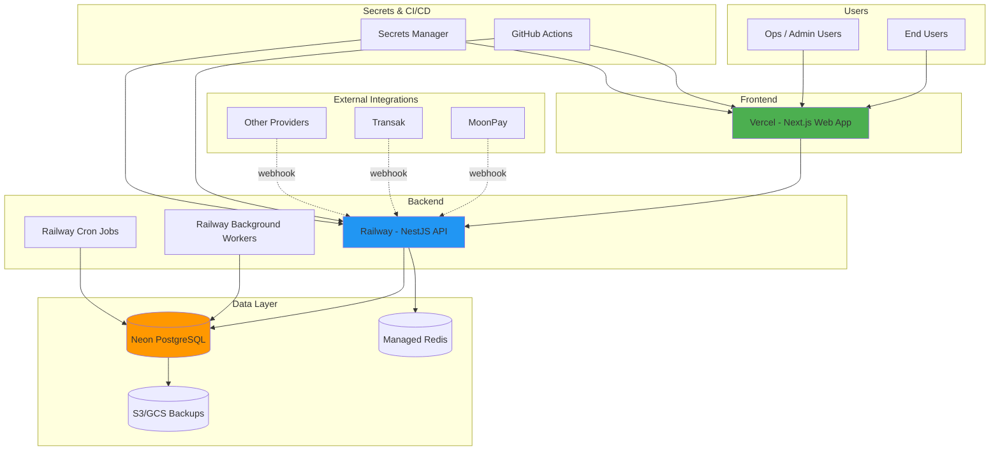

# Deployment

Reference deployment topology for production.

## Deploy Frontend on Vercel

This repository is a monorepo with `backend` and `web`. Deploy the frontend from `web`.

- Import this GitHub repository into Vercel.
- Set **Root Directory** to `web`.
- Set **Framework Preset** to **Next.js**.
- Use **Install Command**: `npm install`.
- Use **Build Command**: `npm run build`.
- Add environment variable:
    - `NEXT_PUBLIC_API_URL=https://<your-backend-domain>`

After setting environment variables, trigger a redeploy.

Also ensure backend CORS includes your Vercel domain.

## Railway + Vercel + Neon Deployment Diagram

